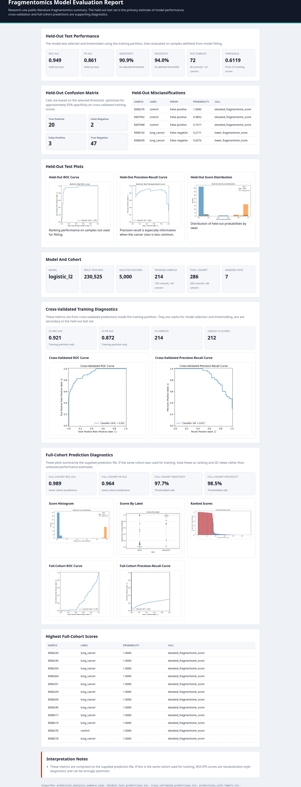

# Fragmentomics NF

Production-style Nextflow DSL2 pipeline for cfDNA WGS fragmentomics research.

The primary pipeline lives in [`fragmentomics_nf/`](fragmentomics_nf/), with full usage notes in [`fragmentomics_nf/README.md`](fragmentomics_nf/README.md).

## Architecture

- [Download the architecture workflow PDF](fragmentomics_nf/docs/assets/architecture_workflow_visual.pdf)
- [View the architecture workflow documentation](fragmentomics_nf/docs/architecture_workflow.md)
- [View the full traceability matrix representation](fragmentomics_nf/docs/traceability_matrix.md)

## Example Report

The repository includes a small rendered example report so the output format is visible without committing raw data or heavyweight pipeline artifacts:

- [`fragmentomics_nf/results/finaledb_lung_demo_300/analysis/prediction_analysis_report.html`](fragmentomics_nf/results/finaledb_lung_demo_300/analysis/prediction_analysis_report.html)
- [`fragmentomics_nf/results/finaledb_lung_demo_300/analysis/prediction_analysis_summary.json`](fragmentomics_nf/results/finaledb_lung_demo_300/analysis/prediction_analysis_summary.json)

Large generated files remain ignored, including Nextflow `work/`, bulk `results/` outputs, raw fragments, reference genomes, feature matrices, model binaries, and compressed genomics artifacts.
