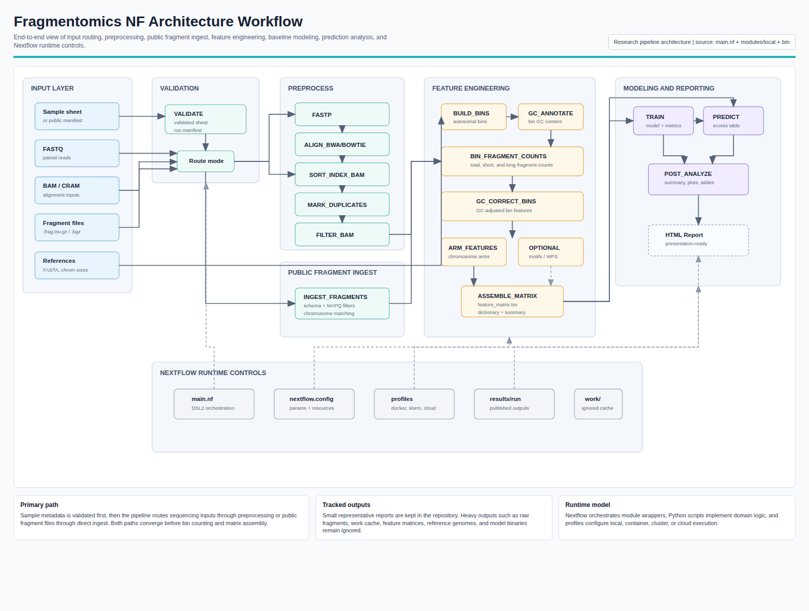
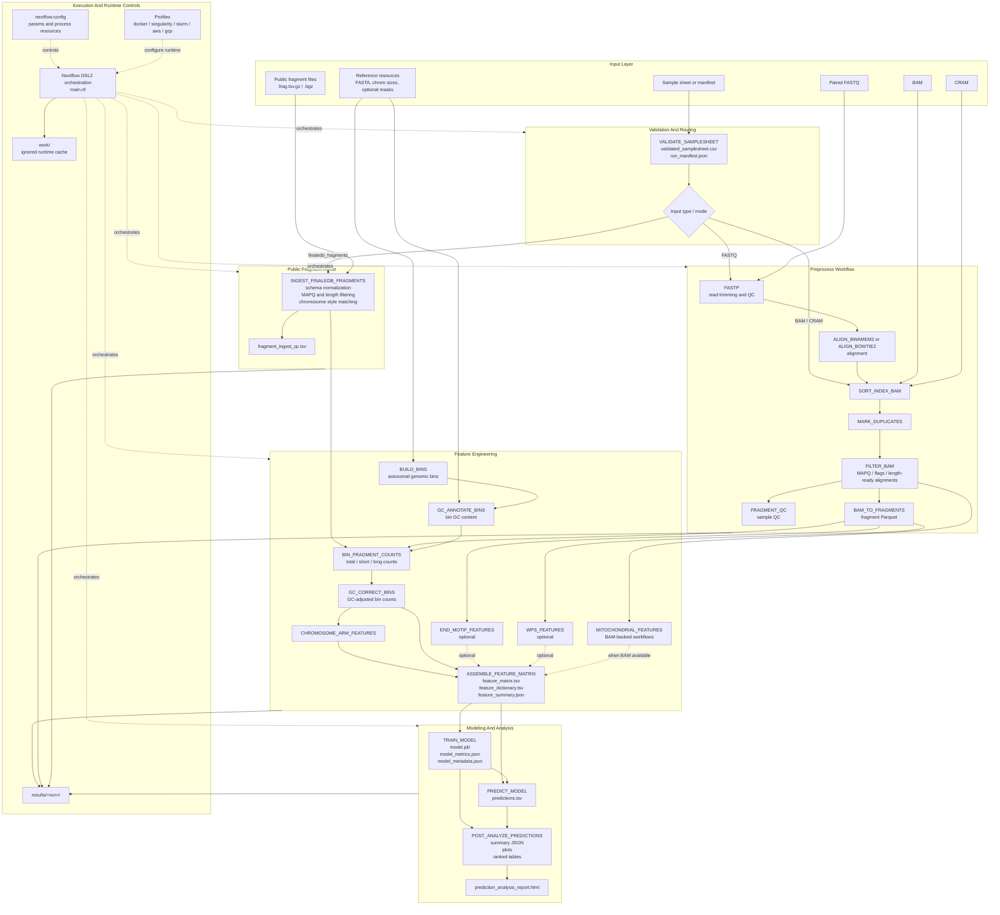

# Architecture Workflow

This diagram summarizes the `fragmentomics_nf` pipeline architecture from inputs through preprocessing, feature extraction, modeling, and reporting.

## Rendered Visual

- [Download the architecture workflow PDF](assets/architecture_workflow_visual.pdf)
- [Open the architecture workflow PNG](assets/architecture_workflow_visual.png)
- [Open the printable HTML source](assets/architecture_workflow_visual.html)



## Mermaid Source



## Layer Summary

| Layer | Responsibility | Key Files |
| --- | --- | --- |
| Input layer | Accept user-provided sample metadata, sequencing files, fragment files, and reference resources. | `README.md`, `docs/usage.md`, `assets/schema_input.json`, `assets/schema_params.json` |
| Validation and routing | Normalize input metadata and choose the correct workflow path. | `main.nf`, `modules/local/validate_samplesheet.nf`, `bin/validate_samplesheet.py` |
| Preprocess workflow | Convert FASTQ/BAM/CRAM inputs into filtered alignments and fragment records. | `modules/local/fastp.nf`, `align_*.nf`, `sort_index_bam.nf`, `mark_duplicates.nf`, `filter_bam.nf`, `bam_to_fragments.nf` |
| Public fragment ingest | Normalize public fragment files into the same fragment representation used by downstream feature extraction. | `modules/local/ingest_finaledb_fragments.nf`, `bin/ingest_finaledb_fragments.py`, `bin/finaledb_metadata.py` |
| Feature engineering | Build bins, annotate GC, count fragments, correct counts, and assemble a feature matrix. | `modules/local/build_bins.nf`, `gc_annotate_bins.nf`, `bin_fragment_counts.nf`, `gc_correct_bins.nf`, `assemble_feature_matrix.nf` |
| Modeling and analysis | Train baseline models, generate predictions, summarize performance, and render reports. | `modules/local/train_model.nf`, `predict_model.nf`, `post_analyze_predictions.nf`, `bin/train_model.py`, `bin/predict.py`, `bin/post_analyze_predictions.py` |
| Runtime controls | Configure Nextflow execution, process resources, profiles, output locations, and ignored runtime cache. | `nextflow.config`, `conf/*.config`, `.gitignore` |

## Primary Data Flow

```text
sample metadata
  -> validation
  -> fragments
  -> bin-level counts
  -> GC-corrected features
  -> feature matrix
  -> model training / prediction
  -> prediction analysis report
```

## Architecture Notes

- `main.nf` is the orchestration boundary; most domain behavior lives in Python scripts under `bin/`.
- Nextflow modules under `modules/local/` are thin process wrappers that publish outputs into `results/<run>/`.
- Public fragment ingest and BAM-derived fragment extraction converge on Parquet fragment files before feature extraction.
- Optional feature families are parameter-controlled and can be added to the matrix without changing the core count and GC-correction path.
- Runtime cache and heavyweight generated outputs remain outside source control; only small representative report artifacts are tracked.
