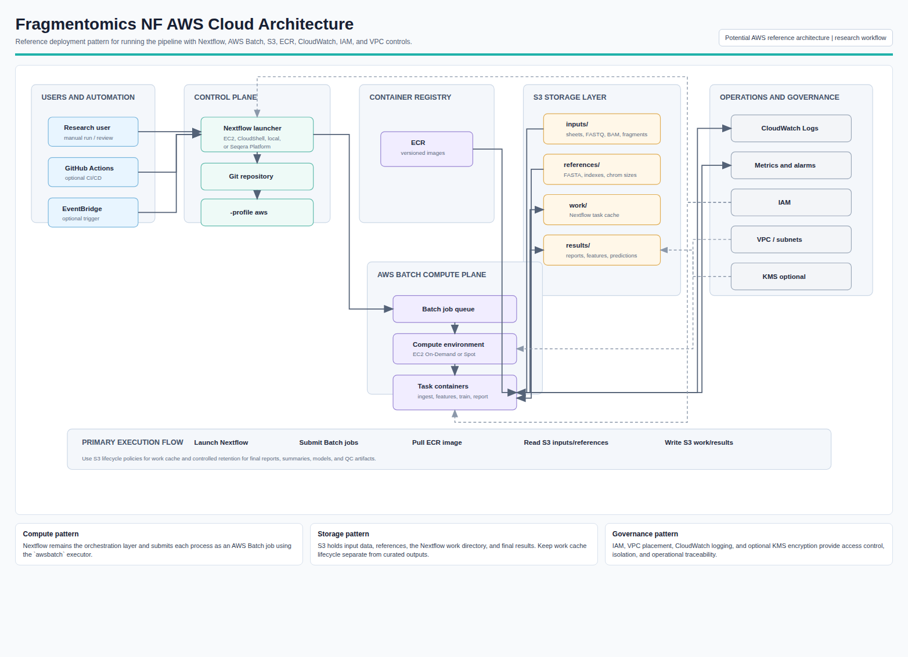
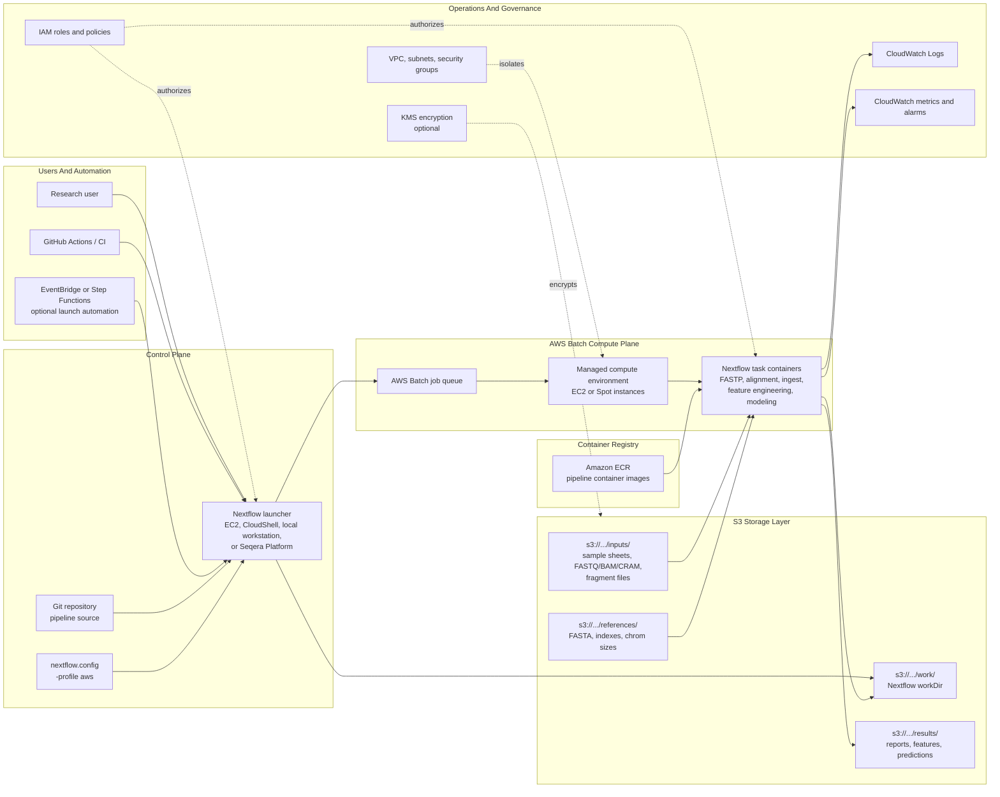

# AWS Cloud Architecture

This document describes a potential AWS architecture for running `fragmentomics_nf` with Nextflow and AWS Batch. It is a reference design, not a locked deployment specification.

## Rendered Visual

- [Download the AWS architecture PDF](assets/aws_cloud_architecture.pdf)
- [Open the AWS architecture PNG](assets/aws_cloud_architecture.png)
- [Open the printable HTML source](assets/aws_cloud_architecture.html)



## Reference Architecture



## Component Summary

| Layer | AWS Service / Component | Role In The Pipeline |
| --- | --- | --- |
| Launch/control | EC2, local workstation, AWS CloudShell, or Seqera Platform | Starts `nextflow run`, resolves configuration, submits tasks to AWS Batch. |
| Workflow engine | Nextflow with `-profile aws` | Orchestrates pipeline processes and tracks task state. |
| Compute | AWS Batch | Runs each Nextflow process as a containerized Batch job. |
| Containers | Amazon ECR | Stores versioned images containing pipeline runtime dependencies. |
| Object storage | Amazon S3 | Stores inputs, reference files, Nextflow work directories, and published results. |
| Logs | CloudWatch Logs | Captures stdout/stderr from AWS Batch jobs. |
| Monitoring | CloudWatch metrics and alarms | Tracks failures, queue depth, compute utilization, and cost-sensitive signals. |
| Security | IAM | Grants least-privilege access to S3, Batch, ECR, CloudWatch, and optional KMS keys. |
| Network | VPC, private subnets, NAT or VPC endpoints | Controls network placement for Batch compute resources. |
| Encryption | S3 SSE-S3 or SSE-KMS | Protects stored input, work, and result objects. |

## Suggested S3 Layout

```text
s3://<bucket>/fragmentomics/
  inputs/
    samplesheets/
    fastq/
    bam/
    cram/
    fragments/
  references/
    hg19/
    hg38/
  work/
  results/
    <run_name>/
  logs/
```

For large runs, keep `work/` separate from curated `results/` so lifecycle policies can expire intermediate task data without removing final reports.

## Execution Pattern

Example shape:

```bash
nextflow run main.nf \
  -profile aws \
  --mode feature_extract \
  --input_type finaledb_fragments \
  --input s3://<bucket>/fragmentomics/inputs/samplesheets/manifest.tsv \
  --chrom_sizes s3://<bucket>/fragmentomics/references/hg19/hg19.chrom.sizes \
  --fasta s3://<bucket>/fragmentomics/references/hg19/hg19.fa \
  --outdir s3://<bucket>/fragmentomics/results/<run_name> \
  -work-dir s3://<bucket>/fragmentomics/work/<run_name> \
  -resume
```

The current repository includes an initial AWS profile in `conf/aws.config`:

```groovy
process.executor = 'awsbatch'
aws.region = params.aws_region ?: 'us-east-1'
```

A production AWS deployment would usually add Batch queue names, container image references, IAM roles, S3 work directory conventions, retry policy, and per-process resource tuning.

## Recommended Deployment Decisions

| Decision | Conservative Starting Point |
| --- | --- |
| Compute model | AWS Batch managed compute environment using EC2 On-Demand for initial validation. |
| Cost optimization | Add Spot instances after task retry behavior and data-transfer patterns are understood. |
| Storage | S3 Standard for active inputs/results; lifecycle `work/` to expire after review. |
| Container strategy | Build one versioned ECR image for the pipeline, then split images only if dependency conflicts emerge. |
| Network | Private subnets with S3/ECR/CloudWatch VPC endpoints where possible. |
| Logging | Retain CloudWatch logs long enough for troubleshooting and presentation reproducibility. |
| Security | Separate IAM roles for launcher and Batch jobs; restrict S3 access to project prefixes. |

## Operational Flow

1. Build and push the pipeline container image to Amazon ECR.
2. Upload sample sheets, fragment files or sequencing files, and reference resources to S3.
3. Launch Nextflow with `-profile aws` from an approved launcher environment.
4. Nextflow submits each process to AWS Batch.
5. Batch pulls the container image from ECR and reads inputs from S3.
6. Task intermediates are written to the S3 work directory.
7. Published outputs are written to the S3 results directory.
8. CloudWatch captures task logs and operational metrics.
9. Review final HTML reports, prediction summaries, feature outputs, and QC artifacts from S3.

## Controls And Caveats

- Raw genomics files and model artifacts should stay in controlled S3 locations, not Git.
- S3 bucket policies, IAM roles, and optional KMS keys should reflect the sensitivity of the data.
- Reference genome build must match sample/fragment coordinates.
- Same-cohort training and prediction can inflate apparent performance; independent validation remains a study-design requirement.
- This architecture supports research workflows and does not by itself create a clinically validated system.

